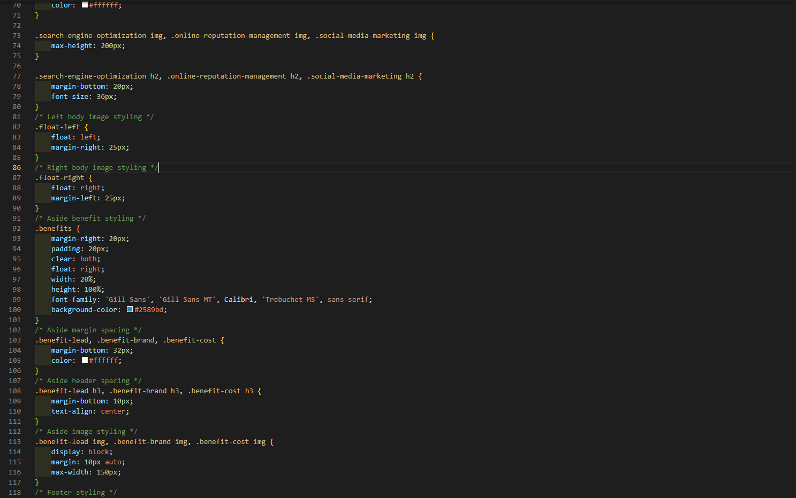

# Code Refactor
## <a href="https://recioj.github.io/01code-refactor/" target="_blank">Live Link</a>

This task was focusing on the utilization of **Semantic Elements** while **Refactoring** to make the site appear unchanged on the *users* end but readable and unclutterd to editing *Developers*. **Refactoring** code for this task using **Semantic Elements** to reconstruct unnecessary code and defining different parts of a web page to clearly describe its intended meaning or function to browser and developer.

## Code Snippet
````html
<figure class="hero"></figure>
    <main class="content">
        <div id="search-engine-optimization" class="search-engine-optimization">
            
            <h2>Search Engine Optimization</h2>
            <p>
                The dominance of mobile internet use means that users are searching for the right business as they
                travel, shop, or sit on their couch at home. Search Engine Optimization (SEO) allows you to increase
                your visibility and find the right customers for your business.
            </p>
````
## Technologies Used
 - Git - version control system to track changes to source code
 - GitHub - host repository that can be deployed via GitHub pages
 - HTML - used to create or edit elements
 - CSS - styling for html elements on the page

## Example
Here I condensed multiple lines into single lines for classes


## Resources
[W3schools](https://www.w3schools.com/html/)

[GitHub Guide](https://guides.github.com/features/mastering-markdown/)
#
## Author Links
[LinkedIn](https://www.linkedin.com/in/johna-recio-83a024214/)

[GitHub](https://github.com/RecioJ)